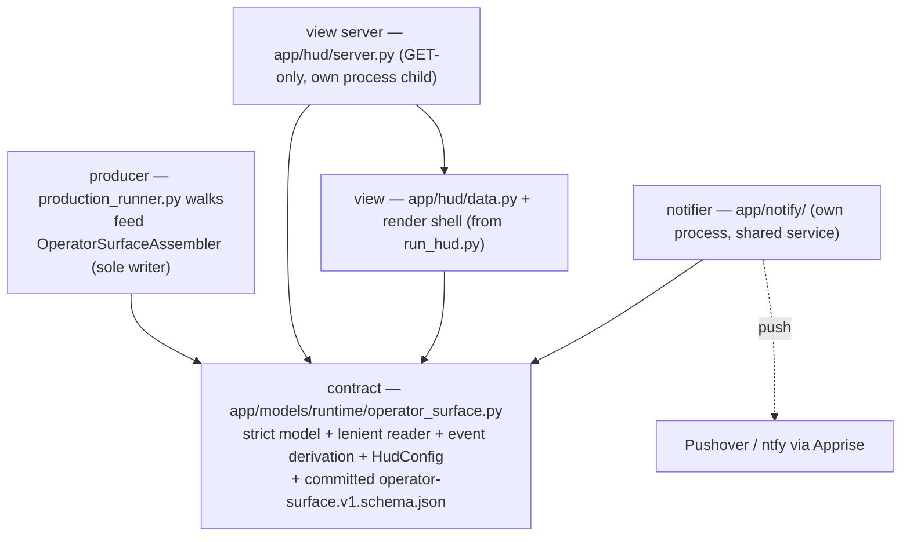

# Architecture Spine — Operator HUD — Flight Deck

## Design Paradigm

**Single-writer projected read model (CQRS-lite).** The production runtime is the sole writer of a small, versioned **operator-surface projection** document; everything HUD-side is a pure, dumb view over that document. Commands (verdicts, recovers, resumes) never flow through this system — they stay on the existing SPOC/gate-CLI surface.

Layers, dependency direction strictly downward:



The contract package imports nothing from orchestrator, hud, or notify. `app/hud/` and `app/notify/` import the contract only — never `production_runner`, never `hud_data_sources` legacy readers, never each other's internals. **These arrows are enforced, not aspirational:** the dev phase adds import-linter contracts (the repo's existing convention, pyproject.toml) forbidding `app.hud`/`app.notify` → `app.marcus.orchestrator`, anything → `hud_data_sources`, and consumer imports of the strict parse surface (AD-4).

## Invariants & Rules

### AD-1 — Runtime-owned operator-surface projection `[ADOPTED]`

- **Binds:** all
- **Prevents:** the HUD re-inferring run state from scattered artifacts (the April failure) and any second source of operator-surface truth.
- **Rule:** one versioned document, `state/config/runs/<trial_id>/operator-surface.json`, modeled by Pydantic `OperatorSurfaceProjection` (`schema_version: "v1"`) in `app/models/runtime/operator_surface.py`. It is the **only** input to HUD data collection and the notifier. If the projection doesn't say it, downstream doesn't show it.

### AD-2 — Emission cadence through one assembler; transition-emit lives in `_persist_envelope` `[ADOPTED]`

- **Binds:** producer
- **Prevents:** the standing two-walk gotcha (a pause side-effect landing in one walk and not the other) AND dueling uncoordinated writers vs a permanently stale HUD — `_persist_envelope` alone cannot see steps/pre-flight/health, and transition-only emission breaks the UX 5s staleness budget on any long node.
- **Rule:** all emission funnels through the projection assembler (AD-15). Exactly three legal emit triggers: **(a)** envelope transition — `assembler.emit(envelope)` called inside `_persist_envelope` (`production_runner.py:221`), covering both walks; the one `run.json` bypass (recover reenter, ~line 3501) is routed through `_persist_envelope`, after which a direct `run.json` write anywhere is a defect; **(b)** section update — pre-flight item completion, health refresh, trace append — via the assembler's section API; **(c)** a periodic freshness tick while `in-flight` at interval ≤ the minimum staleness budget (2s). L1 tripwire: any projection write not routed through the assembler fails CI. Writes are atomic (temp file + `os.replace`) with a bounded retry (verified Windows behavior: `os.replace` raises `PermissionError` while a reader holds the file open — ~5× with short backoff); on exhaustion the write **logs and skips, never propagates into the walk** (`run.json` remains truth per AD-17; the next tick self-heals). Consumers open-read-close in one gulp and never hold a handle across polls; the server reads bytes then responds — streaming the live file is a defect. L1 exercises replace-under-open-reader on Windows.

### AD-3 — Projection self-sufficiency (zero-lie at the data layer)

- **Binds:** view server, view, notifier
- **Prevents:** consumers "enriching" the projection from run.json, coordination.db, bundle gates, or live network calls — the drift that killed the April HUD.
- **Rule:** HUD data collection reads the projection file and nothing else. No `run.json` parse (525KB trap), no coordination.db query, no bundle-gate yaml, no LangSmith call in the data path — external references (LangSmith trace, artifact paths, sample-audio URLs) ride **inside** the projection as plain URLs/paths. The projection carries everything EXPERIENCE.md §Projection Demands lists, including the exact next-action command string per pause class — the HUD never composes commands, and neither does the runner freehand: command strings come from a **builder function co-located with the CLI definition**, and an L1 test round-trips every emitted command through the actual CLI parser for every pause class (a renamed flag fails the producer, not the operator).

### AD-4 — Dual shape-pins + additive-only evolution `[ADOPTED]`

- **Binds:** contract
- **Prevents:** producer changing shape without failing producer tests; consumer drifting from the committed shape.
- **Rule:** two pins, both committed: (a) byte-identical emitted-schema pin — `operator_surface_schema_text() == app/models/schemas/operator-surface.v1.schema.json` (decision-card pin pattern); (b) producer↔consumer parity test (field presence, enum parity, round-trip, bidirectional required/optional — lesson-plan parity pattern). Within `v1`, changes are **additive-only** (new optional fields); any removal/retype/rename bumps `schema_version` and adds a new schema file beside the old. The contract ships **two parse surfaces**: the strict producer model (`extra="forbid"`, the byte-pin source) and `read_operator_surface_lenient(raw)` which ignores unknown added fields and returns a typed `Unrecognized(reason, raw_value, schema_version)` on unknown `schema_version` or status — never raises. **Consumers are forbidden (import-linter) from parsing with the strict model** — a strict parse in the HUD white-screens on the very evolution the contract permits. L1: lenient reader pinned against a future-fields fixture and an unknown-status fixture.

### AD-5 — Envelope vocabulary is the status contract `[ADOPTED]`

- **Binds:** all
- **Prevents:** a HUD-side status vocabulary drifting from `ProductionTrialStatus`.
- **Rule:** the projection embeds envelope status strings verbatim (all seven). L1 evidence: enum set-equality test between projection and `production_trial_envelope.py`, plus the reverse tripwire — envelope status-model files added to `block_mode_trigger_paths` (Tier-2 manifest edit, party-gated, filed as its own story).

### AD-6 — Transport: GET-only localhost server, ETag poll; SSE deferred `[ADOPTED]`

- **Binds:** view server
- **Prevents:** an interactive surface growing on the HUD port; unbounded re-parse/re-render churn.
- **Rule:** `app/hud/server.py` is a FastAPI app exposing **GET routes only** (`/` HUD page, `/projection` JSON, `/healthz`): no POST/PUT/DELETE/WebSocket, ever — a mutation route on this app is a defect regardless of intent. `/projection` serves a read-then-respond byte snapshot with an `ETag` of `<schema_version>:<seq>` (never mtime+size — same-size rewrites inside timestamp granularity would silently skip updates), and the route **implements the `If-None-Match` → `304` comparison itself** (verified: Starlette `FileResponse` sets ETag but never returns 304); the page polls every 2–5s with `If-None-Match` and re-renders only on 200. Own port, distinct from the runtime server and gate endpoint, from config key `hud.port` [ASSUMPTION: default 8791]. SSE is a deferred Tier-1 follow-on; adopting it must not change the projection contract.

### AD-7 — Server lifecycle: runtime-session-owned, pre-flight-gated `[ADOPTED]`

- **Binds:** producer, view server
- **Prevents:** the HUD server becoming a second long-lived daemon with its own state, or silently absent when a run starts.
- **Rule:** start sequence is pinned: mint `trial_id` → create run dir → write the `registered` projection (via assembler) → launch the HUD server (dir + projection guaranteed to exist) → run pre-flight (whose healthz item validates identity, below) → spawn SPOC. The server is a child of the runtime session, holds zero state beyond its bound `trial_id` + run-dir path, survives run completion while the session lives, and dies with the session. **The healthz pre-flight item is identity-checked:** `/healthz` returns `{trial_id, launch_nonce, mode: session|standalone}` and the item passes only on trial_id + nonce match with what the start path minted — a child bind failure is a pre-flight FAIL, never a fall-through to whatever answers the port. A standalone `trial hud --trial-id <id>` CLI may serve an existing run dir read-only for post-hoc viewing [ASSUMPTION]; it binds an **ephemeral port** and refuses `hud.port` when taken. L2 fixtures include wrong-server-on-port. Server logs to `<run_dir>/hud-server.log`; a mid-run server death never touches the run — SPOC and the runtime are unaffected, and the server is restartable via `trial hud`.

### AD-8 — Identity binding; the silent wrong-run fallback dies `[ADOPTED]`

- **Binds:** view server, view
- **Prevents:** the April `_query_active_run_id` → newest-mtime-bundle fallback rendering the wrong run with no indication.
- **Rule:** the server binds one `trial_id` at launch (explicit argument from the runtime start path — never discovery). The projection carries `trial_id`; on mismatch or ambiguity the view renders REFUSE-TO-RENDER (UX spine state), never a substitute run. The coordination.db reader, `_find_latest_bundle`, and the bundle-gate yaml pipeline are **deleted from the HUD path** (retire story), not bypassed.

### AD-9 — Notifier is a shared service, decoupled by the projection `[ADOPTED]`

- **Binds:** notifier
- **Prevents:** notification logic braided into the HUD or the runner; a future dev-side producer needing HUD internals.
- **Rule:** `app/notify/` exposes `notify(event_class, title, message, priority)` plus a projection-watcher that derives the five v1 event classes (`paused_at_gate`, `paused_at_error`, `batch_pause_resumed`, `health_threshold`, `run_stalled`) from projection transitions. It consumes the projection file and `state/config/hud-config.yaml` only. Channel split: **push** is the notifier's (through **Apprise** URL strings — primary **Pushover**, fallback **ntfy**, web-verified 2026-07-11 — so mechanism swap is config, not code); **on-HUD visual and sound** are the HUD page's, rendered/played from projection state + the config echo — the notifier never drives the browser. **Lifecycle — the watchdog must not die with what it guards:** the notifier runs as its **own process**, launched by the start path but not fate-shared with the runtime session's Python process; it exits on terminal run status plus a grace period. It detects producer death: projection mtime frozen while status `in-flight` and the producer process gone → `run_stalled` with a "producer dead" reading. **Restart semantics pinned:** the notifier persists `{last_processed_progress_seq, last_status}` in its own state dir (never the run dir — single-writer rule); `paused_*`/`run_stalled` fire when the condition is active and unacknowledged in that state file; `batch_pause_resumed` fires on observed transition only. L2 fixture: restart-mid-pause. Lives outside `app/gates/**` (import-linter forbids `threading`/scheduler there). Credentials via env, never in config or repo. Notifier failures never propagate to the runner or the server loop. The assembler **echoes the parsed config (and its parse status) into the projection's `notifications` section** — that echo is what the HUD renders (header chip, "config unreadable — defaults active"), keeping AD-3 intact. Apprise targets are restricted to the two configured push URLs: email/webhook channels stay OUT of v1 (brief scope) — adding a channel class is a scope change, not a config line.

### AD-10 — Stall watchdog rides projection monotonicity

- **Binds:** producer, notifier
- **Prevents:** "AFK while wedged" — nominally in-flight with nothing moving and no signal.
- **Rule:** two counters, two owners of meaning. `seq` = write counter (bumps on every write incl. freshness ticks; feeds the ETag). `progress_seq` + `last_progress_at` = advance **only** on walk-index change, node lifecycle event, pre-flight item completion, or gate/pause/resume transition — freshness ticks and health refreshes are forbidden from bumping them (L1 test). The watchdog binds to `progress_seq` exclusively and fires `run_stalled` when status is `in-flight` and it hasn't advanced within the configured budget [ASSUMPTION: default 600s]. (`waiting_for_provider_batch` is exempt by status.) No new heartbeat substrate; monotonicity of the single document is the heartbeat.

### AD-11 — Pre-flight/heartbeats are runtime-executed, projection-reported `[ADOPTED]`

- **Binds:** producer
- **Prevents:** the HUD (or any viewer) running checks itself — pre-flight must stay authoritative with the HUD closed.
- **Rule:** the runtime start path executes pre-flight (phase 01) and live heartbeats (phase 02, real calls, never mocked/cached) and gates SPOC spawn on them; per-item results (state, output, latency, quota reading + `direct|proxy|unknown` confidence) are written into the projection as they complete. Quota/credit readings may claim green only with `direct` or `proxy` confidence (brief's never-false-green). **Item inventory is data, not code:** phase-01 items derive from the `ready_for_trial` check set adapted in-runtime; phase-02 heartbeats derive from the run's actual dependency set (component selection + specialist/service registry) — both under the falter-surface contract (anything whose absence would make the runtime falter is on the list). Heartbeat state vocabulary distinguishes `missed` (reading absent/overdue) from `fail` (check ran and failed) — two different alarms. Per-platform quota mechanics follow brief addendum §C (OpenAI usage/costs needs a separate **Admin API key** env var, not the inference key; Gamma `credits.remaining` piggybacks generation polls, last-seen + staleness between polls).

### AD-12 — Reuse tier: retarget data layer, keep render shell `[ADOPTED]`

- **Binds:** view
- **Prevents:** torching ~98 passing render pins for aesthetics; equally, keeping legacy data readers out of sunk cost.
- **Rule:** `render_html(data)`-style pure-dict rendering and the urgency auto-expand contract carry forward; the data layer is replaced by a thin projection reader (new `read_operator_surface(run_dir)` — explicit path argument, the injection seam L2 fixtures require; no ambient discovery). Dev-Cycle and M5 panels are retired with their pins; render pins are re-pointed at projection-fed fixtures. **`run_hud.py` disposition is pinned:** it becomes a deprecation stub (exits with a pointer to `trial hud`) in the retire story; `tests/test_run_hud.py` retires with it; the Tier-2 manifest bump updates its trigger-path rows in the same change; import-linter forbids anything importing `hud_data_sources`. `collect`/`render` stays a pure seam: data in, HTML out, no I/O inside render. **Poll updates are in-place, never full-page:** the poll loop applies section-scoped DOM replacement keyed by zone id (re-applying the urgency contract), preserving disclosure state, scroll position, and text selection — a snapshot that wipes the operator's half-selected command block is a defect. Full-page render is cold-load only. The April `location.reload()` pattern retires.

### AD-13 — Evidence ladder L1/L2/L3 `[ADOPTED]`

- **Binds:** all
- **Prevents:** wrong-but-plausible state during a live paused run (risk R1, High/High).
- **Rule:** L1 — enum/contract tests (AD-4, AD-5). L2 — golden run-dir fixtures per pause class, plus one legacy-shaped dir rendering UNRECOGNIZED, a narrowed-component-selection run, and a recover-reenter run (the wrong-server-on-port, skewed-pair, and notifier-restart fixtures are pinned in AD-7/AD-17/AD-9). L3 — one first-run-stands live witness per pause class as it lands, promoted into the L2 golden set. L4 — the arc-level usage witness (brief SC5): the operator completes the next real production trial using only HUD + SPOC; v1 pays for itself in that trial or we cut deeper. **Falter-surface regression rule:** any runtime falter attributable to a checkable dependency that pre-flight passed is a pre-flight defect — each occurrence adds that check permanently. Every story's DoD names its witness set. HUD tests touching network/db are marked `serial` or `live` (xdist default excludes them).

### AD-14 — Lockstep governance boundary `[ADOPTED]`

- **Binds:** all
- **Prevents:** HUD work slipping past the pipeline-manifest regime.
- **Rule:** `run_hud.py`/`progress_map.py`/their tests are already `block_mode_trigger_paths`; the new contract, producer-emission, HUD server, and notifier files are added to the list via one Tier-2 manifest bump, **party-gated before dev opens** (its own pre-dev story, bundled with the AD-5 reverse tripwire). Trigger paths MAY be registered ahead of file creation and are inert until the paths exist; the lockstep checker must never require their existence.

### AD-15 — The projection assembler is the single writer and owns non-envelope sections

- **Binds:** producer
- **Prevents:** `_persist_envelope` (which sees only the envelope) being asked to produce steps/pre-flight/health/specialist sections it cannot supply — forcing either validation crashes or a schema-satisfying projection that lies by omission; and two stories building incompatible write paths to one document.
- **Rule:** a runtime-owned `OperatorSurfaceAssembler` (contract-typed, instantiated per trial) is the **only** code that writes `operator-surface.json`. The walk feeds it sections as they materialize: steps on manifest composition (carrying the composed manifest's identity — compiled-graph digest + node count — and a `walk_generation`/`reentered_from` marker incremented on recover-reenter, so index regression renders as labeled re-entry, not corruption), pre-flight items as tested, health on refresh, trace on event. `_persist_envelope` calls `assembler.emit(envelope)`. Per-lifecycle-stage presence rules are part of the contract: at `registered` only identity + notifications-echo are mandatory (pre-flight pending); once `in-flight`, steps and health are mandatory. The assembler owns both counters (AD-10), performs section-scoped merges, serializes writes through one in-process lock, and does bounded work only — serialize + write, no network, no expensive recompute.

### AD-16 — The projection stays small

- **Binds:** producer, contract
- **Prevents:** the 525KB `run.json` trap reborn — append-only trace and per-transition health history growing the document unboundedly, re-shipped and re-parsed every poll.
- **Rule:** the projection is a bounded snapshot: state-trace section is a ring buffer (last 200 events [ASSUMPTION]; the full trace stays in run-dir artifacts/logs), health history capped per tile (last 50 readings [ASSUMPTION]). Target ≤128KB serialized; an L1 size tripwire fails loud above 256KB. If a full operator-visible trace is ever wanted, it is a sidecar with its own contract — explicitly deferred.

### AD-17 — `run.json` is truth; the projection is a reconciled derivation

- **Binds:** producer, view, notifier
- **Prevents:** a crash between the `run.json` persist and the projection write leaving two truths forever — HUD showing IN FLIGHT over a paused run, the pause push never firing.
- **Rule:** the projection carries `envelope_digest` (hash of the `run.json` content it derives from). Every runner entry point — start, continue/resume, recover, resume-batch, status — re-emits the projection from the current envelope **before doing anything else** (idempotent, cheap). Consumers never read `run.json` (AD-3 stands); their guard is staleness + the watchdog, not reconciliation. L2 fixture: a skewed pair must render the `run.json`-derived state after any runner touch, and the HUD alone must surface staleness, never invent agreement.

### AD-18 — Event-class derivation is a contract-owned pure function

- **Binds:** contract, view, notifier
- **Prevents:** the notifier (push) and the HUD page (toast) deriving the five event classes independently and drifting on edges — phone buzz with no toast, toast with no push.
- **Rule:** `derive_event_transitions(prev, cur) -> list[EventClass]` lives in the contract package (imports nothing outward, per the layer rule); the notifier and the view both consume it — nobody re-implements derivation. L1 parity test pins all five classes against golden transition fixtures (including resume-that-repauses and recover-reenter edges).

### AD-19 — `HudConfig` has one owner in the contract package

- **Binds:** contract, producer, view server, notifier
- **Prevents:** three units each shipping their own `hud-config.yaml` loader and defaults — header chip and phone disagreeing about whether push is on, a zero-lie violation manufactured from config ambiguity.
- **Rule:** a `HudConfig` Pydantic model + single loader + single defaults constant live in the contract package; producer (assembler echo), HUD server, and notifier all import it; defaults are defined exactly once; schema-pin test alongside AD-4's. The file itself does not exist yet — the contract story creates it.

## Consistency Conventions

| Concern | Convention |
| --- | --- |
| Naming | Projection file `operator-surface.json`; schema files `operator-surface.v1.schema.json` (then `.v2.`, … on version bump); event classes snake_case matching EXPERIENCE.md §Notifications; config keys under `hud.` / `notify.` in `state/config/hud-config.yaml` |
| Data & formats | All timestamps UTC ISO-8601; envelope status strings verbatim (mixed separators preserved); ids are the existing `trial_id` UUIDs; every projection section carries its own `as_of` timestamp; money as USD floats matching cost-report |
| State & cross-cutting | Projection writes atomic (temp + `os.replace`); consumers tolerate unknown *added* fields, refuse unknown `schema_version`; all consumer file-reads mtime-gated; errors in the notifier never propagate to the runner (fire-and-forget with local log); push credentials env-only |

## Stack

| Name | Version |
| --- | --- |
| Python | >=3.11 (repo pin) |
| Pydantic | >=2.7,<3 (repo pin) |
| FastAPI / uvicorn | >=0.136,<1 / >=0.45,<1 (already deps) |
| requests | >=2.31,<3 (already dep) |
| Apprise | >=1.9.8,<2 (new dep [ASSUMPTION]; current 1.12.0, 2026-07-04) |
| jsonschema | >=4,<5 (dev extra; parity tests) |

## Structural Seed

```text
app/
  models/runtime/operator_surface.py        # contract: strict model + lenient reader +
                                            #   derive_event_transitions + HudConfig (AD-4/18/19)
  models/schemas/operator-surface.v1.schema.json  # committed byte-pin
  marcus/orchestrator/
    production_runner.py                    # assembler.emit(envelope) inside _persist_envelope (AD-2)
    operator_surface_assembler.py           # OperatorSurfaceAssembler — sole writer (AD-15)
  hud/
    server.py                               # GET-only FastAPI app, identity-checked healthz (AD-6/7)
    data.py                                 # read_operator_surface_lenient(run_dir) — the only reader
    render/                                 # render shell retargeted from run_hud.py (AD-12)
  notify/
    service.py                              # notify() + projection watcher + watchdog — own process (AD-9)
state/config/hud-config.yaml                # notification matrix + budgets + hud.port (AD-19 owns schema)
state/runtime/notify/                       # notifier's own state dir (never the run dir)
tests/
  unit/models/test_operator_surface_shape_pin.py   # AD-4a
  contracts/test_operator_surface_parity.py        # AD-4b
  hud/  notify/                                    # L2 golden fixtures (AD-13)
```

## Capability → Architecture Map

| Capability (UX zone / demand) | Lives in | Governed by |
| --- | --- | --- |
| Annunciator, header, map, briefings, health strip, state-trace | `app/hud/render/` fed by `app/hud/data.py` | AD-3, AD-12, DESIGN.md tokens |
| Envelope status + pause metadata + next-action command | projection fields | AD-1, AD-3, AD-5 |
| Pre-flight + heartbeat board | runtime start path → projection `preflight` section | AD-11 |
| Two-stage you-are-here map | projection `steps` (stage-1 manifest + ratified `hud_tracked` nodes, walk index) | AD-1, AD-3 |
| Self-update within staleness budget | ETag poll loop | AD-6 |
| Run identity guard | server binding + projection `trial_id` | AD-8 |
| Notifications incl. phone push + stall watchdog | `app/notify/` | AD-9, AD-10 |
| Zero-lie / UNRECOGNIZED rendering | consumer schema_version + enum handling | AD-4, AD-5 |
| Cost/credits with confidence tags | projection `health` section sourced from cost-report + heartbeat readings | AD-3, AD-11 |

## Deferred

- **SSE / served operator API** — only if the gate-verdict flow independently justifies it; projection contract must not change (AD-6).
- **Dev-side stall producer** — the notifier is already producer-agnostic (AD-9); wiring dev-auto runs is a later arc.
- **Projection v2 fields** (fleet/history, per-specialist deep telemetry) — v1 is additive-only; v2 waits for a real consumer.
- **Gamma/Descript/ElevenLabs credit-fetch mechanics beyond addendum §C** — heartbeat implementations decide per-platform at story level under AD-11's confidence rules.
- **Exact port value, sound assets, Pushover app-per-event-class setup** — story-level config; defaults [ASSUMPTION]-tagged in `hud-config.yaml`.
- **Legacy `run_hud.py` bundle-pipeline panels beyond the HUD path** — retired for the HUD (AD-8, AD-12 stub disposition); whether any dev-dashboard salvage happens elsewhere is out of scope.
- **SSE / actionable-affordance party rider** — per party plan §4, any future actionable affordance (or served mutation API) on the HUD requires a fresh party gate; the AD-6 GET-only rule is the structural guard, this rider is the governance one.
- **UX Flow-1 "HUD already up between runs"** — with the server session-owned (AD-7), a browser tab pointed at `hud.port` between sessions shows a dead connection, not the styled NO-ACTIVE-RUN state (which remains reachable in standalone mode). Reconcile the EXPERIENCE.md beat at story time — spine wins; one-line UX update owed.
