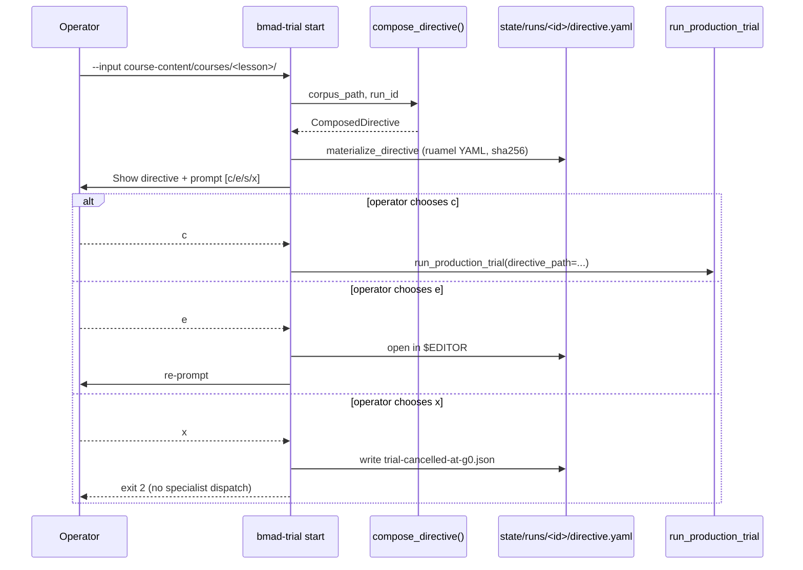

# G0 — Directive Composition (operator at-gate context)

> Story 7a.1 / Slab 7a inter-gate orchestration. This document loads inline into
> the G0 decision-card per FR-O3 — operators never recall legacy v4.2 prose to
> participate in directive composition.

## (a) What the directive is

The **directive** is the YAML file Texas reads at trial start to know what
sources to retrieve. It lives at `state/runs/<trial_id>/directive.yaml` and has
the shape:

```yaml
run_id: <trial-uuid>
sources:
  - ref_id: src-001
    provider: local_file
    locator: intro.md
    role: primary
    description: Auto-derived from corpus dir: intro.md
    expected_min_words: 200
```

Each `sources[]` entry tells Texas one thing to fetch:

| field | meaning |
|-------|---------|
| `ref_id` | stable identifier (`src-001`, `src-002`, ...) used in audit trails |
| `provider` | how to fetch — `local_file` (on-disk), `url` (from urls.txt), or one of the live-fetch providers |
| `locator` | path or URL — POSIX form for cross-platform stability |
| `role` | `primary` (load-bearing) or `supporting` (context/reference) |
| `description` | human-readable note for the audit trail |
| `expected_min_words` | floor below which Texas refuses the source as too-thin |

> **Live-fetch reservation:** Notion / Box-URL / Playwright-URL provider shapes
> are reserved for Texas's `_act` in a later story; G0 composer emits the
> `provider:` entry but does not fetch. Story 7a.1 ships only `provider:
> local_file` (on-disk corpus) and `provider: url` (from a `urls.txt` flat file
> in the corpus dir).

## (b) Why operator-confirm matters

The composer is fully automated for the on-disk-files MVP shape, but the
operator's confirm-or-edit pass at G0 is the substrate's last chance to catch a
mis-targeted run **before** specialist dispatch costs time and cost. Trial-475
(2026-04-28 evening, paused-at-G1) revealed that without operator confirm,
Texas falls back to a fixture stub when the directive is empty — silent
gate-bypass. G0 confirm closes that root cause.



## (c) When to edit vs accept

| situation | typical choice |
|-----------|----------------|
| corpus dir holds exactly the files you intend Texas to read; auto-walker picks the right `primary` | **[c] confirm** |
| auto-walker picked the wrong file as `primary` (e.g. alphabetical order surfaced an appendix first) | **[e] edit** — swap the `role:` values |
| you want Texas to enforce a stricter `expected_min_words` floor on a thin source | **[e] edit** — bump the value (or future: pin via `--operator-directives` flag) |
| corpus contains a `urls.txt` whose entries you want skipped this trial | **[e] edit** — delete the corresponding `provider: url` rows |
| you realize the corpus path is wrong altogether | **[x] cancel** — fix the `--input` and rerun trial start |
| you want to inspect the composed directive offline before deciding | **[s] save** — exits without running; inspect at the printed path |

## (d) Worked example — on-disk-files MVP shape

Corpus directory `course-content/courses/example-lesson/`:

```text
course-content/courses/example-lesson/
├── intro.md         (~500 words)
├── chapter-1.md     (~1200 words)
└── appendix.md      (~300 words)
```

Run:

```bash
python -m app.marcus.cli trial start \
    --input course-content/courses/example-lesson/ \
    --operator-id juanl \
    --allow-offline-cost-report
```

Composer output (written to `state/runs/<trial_id>/directive.yaml`):

```yaml
run_id: 12345678-1234-1234-1234-123456789abc
sources:
  - ref_id: src-001
    provider: local_file
    locator: appendix.md
    role: primary
    description: 'Auto-derived from corpus dir: appendix.md'
    expected_min_words: 200
  - ref_id: src-002
    provider: local_file
    locator: chapter-1.md
    role: supporting
    description: 'Auto-derived from corpus dir: chapter-1.md'
    expected_min_words: 200
  - ref_id: src-003
    provider: local_file
    locator: intro.md
    role: supporting
    description: 'Auto-derived from corpus dir: intro.md'
    expected_min_words: 200
```

Notice `appendix.md` landed as `primary` because the walker sorts
alphabetically. The operator likely wants `chapter-1.md` as primary — choose
**[e] edit**, swap the `role:` values, save, then **[c] confirm** at the next
prompt.

## References

- Story 7a.1 spec: `_bmad-output/implementation-artifacts/migration-7a-1-directive-composer.md`
- Texas directive shape: `tests/fixtures/specialists/texas/fixture_directive.yaml`
- Composition Spec §3.1, §3.3, §3.5, §3.6: `docs/dev-guide/composition-specification.md`
- Slab 7a PRD §FR1-FR5 + §FR-O3: `_bmad-output/planning-artifacts/prd-slab-7a-inter-gate-orchestration.md`
