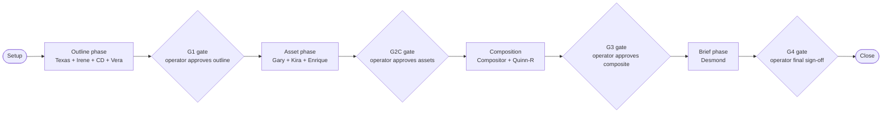

# Production Run Swimlane — Animated Slide Presentation + Video

**Audience:** Human-in-the-loop operator running a course-content production trial through the migrated runtime.

**Use this for:** "Where am I in the workflow? What's the platform doing? What did I already decide? What should I watch for?" — at a glance, without diving into specs.

**Calibrate against your trials.** This swimlane reflects the *expected* happy path. Once you've run a few trials, update the time estimates and notes columns with what you actually observed. The platform's behavior is reasonably predictable, but specialist runtimes vary with content size, model load, and whether caches are warm.

---

## Visual overview

Solid boxes = platform-autonomous work. Diamond boxes = HIL gate pauses (operator-action). Setup and Close bookend the run.

---

## Detailed swimlane

Legend: 👤 = your action · ⚙ = platform action (Marcus + specialists) · ⏸ = HIL pause · ➡ = carry-forward to next phase · 📝 = notes

| # | Phase | 👤 Operator HIL action | ⚙ Platform action | ➡ Carry-forward | 📝 Notes |
|---|---|---|---|---|---|
| 1 | **Setup** | Run preflight; confirm bundle path; invoke `app.marcus.cli trial start --preset production --input <bundle> --operator-id <you>` | Marcus generates trial-id; registers `state/config/runs/<trial-id>/`; cold-reads sanctum; LangSmith trace project context attaches | Trial-id; bundle path; cascade digest | ~2 min. If `ready_for_trial.{ps1,sh}` shows BLOCKED, fix before starting |
| 2 | **Source intake** | Stand by; observe trace tree start populating in LangSmith | Texas pulls authority sources per `retrieval-contract.md` (transcripts, references, prior content); writes structured receipts to RunState | Source-authority receipts; provenance metadata | ~1-3 min. Watch for Texas retries — frequent retries usually indicate a flaky provider, not bad content |
| 3 | **Editorial synthesis** | Stand by | Irene drafts narrative outline + section headers + voice notes from source-receipts; uses frontier-tier model per cascade | Outline draft; voice notes; Irene's editorial rationale | ~3-5 min. Highest-cost phase per call (frontier model on long-context editorial work). Cost-report begins to grow |
| 4 | **Creative direction** | Stand by | CD layers creative-directive synthesis on top of outline (tone, pacing, visual motif suggestions) | Creative-direction notes; visual style hints for downstream | ~1-2 min. Lower content but high-judgment; CD's output shapes Gary's slide aesthetic |
| 5 | **Verification** | Stand by | Vera checks fidelity-to-source; flags any drift or hallucination claims; emits `LedgerEvent kind="verification"` | Verification verdict + per-claim citations | ~1-2 min. If Vera flags > 0 issues, expect Marcus to surface in DecisionCard at G1 |
| 6 | **⏸ G1 gate — outline approval** | Inspect DecisionCard: read drafted outline + Vera's citations + risks; issue verdict (`approve` / `edit` / `reject`) via CLI | Marcus checkpoint-pauses; emits DecisionCard with `meta.cache_state`, `meta.affected_nodes`, `meta.reject_rate`; awaits operator verdict | Operator verdict (verb + edit_payload if any) → resumes downstream | **~5-15 min operator time.** This is the cheapest gate to reject at — rejection here just re-loops outline; rejection later forces re-do of asset work |
| 7 | **Asset generation (parallel)** | Stand by; spot-check trace as agents fire | Three specialists run in parallel: **Gary** generates Gamma slide deck from approved outline; **Kira** generates Kling motion clips per visual hints; **Enrique** generates ElevenLabs voiceover from voice-notes | Slide deck assets; motion clips; audio tracks; per-asset metadata | ~5-10 min wall-clock (parallel). Highest API spend phase: Gamma + Kling + ElevenLabs all charge per-asset. Watch the cost-report — should stay within budget if cap set |
| 8 | **⏸ G2C gate — asset approval** | Inspect DecisionCard: review per-asset previews (slide thumbnails, motion preview links, audio sample); issue verdict per asset family | Marcus checkpoint-pauses; emits DecisionCard with per-asset thumbnails + cost-actuals + provenance digests | Approved-or-edited asset set → composition phase | **~10-20 min operator time.** Most consequential gate — approving here commits assets to composition. If you reject motion or audio, expect re-generation cost (not free) |
| 9 | **Composition** | Stand by | Compositor assembles slides + motion + audio into final deliverable per CD's pacing notes; produces preview render | Composite deliverable (likely .mp4 or layered package); per-second sync metadata | ~2-4 min. Compositor is dispatch-heavy (lower model tier per cascade); fast and cheap. Watch for sync drift warnings — those usually trace back to timing data lost between phases |
| 10 | **Quality review** | Stand by | Quinn-R reviews composite end-to-end against creative direction + verification spec; emits final QA verdict | QA verdict + per-issue surface (if any) | ~2-3 min. Quinn-R uses frontier-tier model for evaluative reasoning. If issues surface, they bubble into the G3 DecisionCard |
| 11 | **⏸ G3 gate — composite approval** | Inspect DecisionCard: review final composite + Quinn-R's QA findings; issue verdict | Marcus checkpoint-pauses; emits DecisionCard | Approved composite → brief phase | **~10-15 min operator time.** Last chance to reject before final-brief is generated. If composite is wrong, this is where to catch it |
| 12 | **Operator brief** | Stand by | Desmond writes run-scoped operator brief (what was produced, what decisions you made, how to interpret cost-report, recommended next steps) | Operator brief artifact at `state/config/runs/<trial-id>/operator-brief.md` | ~1-2 min. Cheap; bounded synthesis. Brief becomes your reference for "what did this trial actually produce" |
| 13 | **⏸ G4 gate — final sign-off** | Read brief + composite one more time; issue final `approve` verdict | Marcus checkpoint-pauses; emits final DecisionCard with full trial summary | Final operator approval → trial finalize | **~5-10 min operator time.** This gate locks the trial closed; reject here forces re-loop from where you flag the issue |
| 14 | **Close** | Inspect cost-report (`state/config/runs/<trial-id>/cost-report.md`); commit trial artifacts to git if production | Marcus's `finalize` + `handoff` nodes emit final `LedgerEvent kind="verdict"`; mark trial `closed_at`; capture Marcus envelope baseline if first-of-kind | Trial-id closed; LangSmith trace finalized; cost-report locked | ~1 min platform + however long you want for review. Trial is now part of the regression replay set per 5a.1 |

---

## Cumulative pace at-a-glance

For a typical mid-sized animated-slides-with-video deliverable:

| Phase reached | Cumulative wall-clock | Cumulative cost | Operator-attention required |
|---|---|---|---|
| Setup → G1 | ~10-15 min | ~$0.30-0.50 | Low (preflight + trial start) |
| G1 → G2C | +10-15 min platform + your G1 review time | +$0.50-1.50 (asset generation expensive) | High at G1 |
| G2C → G3 | +5-10 min platform + your G2C review time | +$0.10-0.30 (composition cheap) | High at G2C |
| G3 → G4 | +1-2 min platform + your G3 review time | +$0.05-0.10 (brief is cheap) | High at G3 |
| G4 → Close | +1 min | minimal | Low (final sign-off) |

**Total typical trial:** ~30-45 min wall-clock + ~30-60 min operator-attention across 4 gates + ~$1.00-2.50 cost.

Adjust as you observe your actual numbers — first few trials tend to run longer as you familiarize with each DecisionCard's content.

---

## What to watch for

### Green flags (proceed)
- Cost-report grows linearly per phase, no jumps.
- Verification (Vera) returns no issues at phase 5.
- DecisionCards include populated `meta.evidence` and reasoned `meta.risks`.
- LangSmith trace tree shows clean per-specialist spans with no error nodes.
- Drift alerts (5a.3 D9) absent in cost-report.

### Yellow flags (proceed with attention)
- Vera flags 1-2 verification issues at phase 5 — usually fixable at G1 with `edit` verb.
- Drift alert appears for one specialist — note it and continue; investigate post-trial.
- Cost crosses your soft-cap (`MARCUS_TRIAL_BUDGET_USD`) — warning span but trial continues per D7.
- One asset (slide / motion / audio) shows minor quality issue at G2C — `edit` verb if surgical, `reject` if structural.

### Red flags (consider stopping or rolling back)
- Vera flags >5 verification issues — source content may be unsuitable; better to abort + revise inputs than push through.
- A specialist returns errors mid-run that Marcus surfaces — likely a real defect or API outage; stop and diagnose rather than retry blindly.
- Cost is 3x+ over expected for the phase reached — possible runaway loop; stop and inspect the trace.
- Sanctum-mutation warning in DecisionCard meta when you didn't change anything — possibly disk corruption or another process touching the sanctum; investigate before proceeding.

---

## After the run

1. **Read the brief:** `cat state/config/runs/<trial-id>/operator-brief.md` — Desmond's write-up of what happened.
2. **Read the cost report:** `cat state/config/runs/<trial-id>/cost-report.md` — total + per-agent + per-model + drift alerts.
3. **Open the LangSmith trace** linked from the brief; click through any span you found surprising during the run.
4. **Run the dashboard:** `python scripts/utilities/migration_health_dashboard.py` — see your trial appear in the trial-count + median-cost rows.
5. **Commit artifacts** if this was a production run: `git add state/config/runs/<trial-id>/ && git commit -m "trial: <trial-id> — 
"`.

If the trial validated something specific (e.g., closed an M5 condition or an iterate-pending issue), update the relevant deferred-inventory entry.

---

## How this swimlane will improve

- **Once you've run 3-5 trials**, replace the time-estimate columns with your actual observed values; they'll be more useful than my guesses.
- **Once Batch 3 ships HUD modernization**, this swimlane pairs naturally with the HUD's Active Trial panel — the swimlane is the map, the HUD is the "you are here" pin.
- **Once Batch 3 ships ad-hoc CLI**, you can use `python -m app.marcus.cli ask "..."` between phases or pre-trial to sanity-check specialist behavior without committing to a tracked trial — useful when you're learning what each specialist does.
- **For other deliverable types** (audio-only podcast, slide-deck-only, assessment-with-feedback), copy this swimlane and adapt; specialists in scope will differ but the gate structure (G1 outline → G2C assets → G3 composite → G4 sign-off) holds across deliverables.

---

## See also

- [`docs/operator/trial-run-runbook.md`](trial-run-runbook.md) — full step-by-step trial procedure (this swimlane is its at-a-glance companion).
- [`docs/operator/conditional-gate-addendum-playbook.md`](conditional-gate-addendum-playbook.md) — operator-window addenda for M2/M3 conditional gates.
- [`docs/operator/post-m5-runbook.md`](post-m5-runbook.md) — what to do during the M5 SHIP-CONDITIONAL window through 2026-05-03.
- `state/config/pipeline-manifest.yaml` — authoritative §-step manifest (more granular than this swimlane).
- `runtime/config/model_cascade.yaml` — which specialist runs which model + why.
